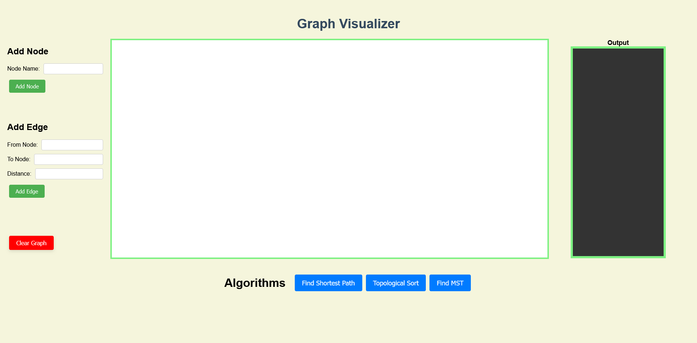

# Graph Visualizer

## Overview
An interactive web-based graph visualizer built with HTML, CSS, and JavaScript. The application allows users to visualize graphs by adding nodes and edges, and features algorithms for finding the shortest path, performing topological sorting, and computing the minimum spanning tree.



## Features
- **Add Nodes**: Add nodes to the graph with custom names.
- **Add Edges**: Connect nodes with edges and specify weights.
- **Shortest Path**: Find the shortest path between two nodes using Dijkstra's algorithm.
- **Topological Sort**: Perform topological sorting on the graph.
- **Minimum Spanning Tree**: Compute the minimum spanning tree.
- **Output**: See the output of all Algorithms.
## Getting Started

### Prerequisites
- Web Browser (Chrome, Firefox, Safari, etc.)
- Text Editor for Code (VS Code, Sublime Text, etc.)

### Running the Project
1. Clone the repository to your local machine.
    ```bash
    git clone https://github.com/mishra-mihir/graph-visualizer.git
    ```
2. Navigate to the project directory.
    ```bash
    cd graph-visualizer
    ```
3. Open the `index.html` file in a web browser.

## Usage
1. Enter node names in the "Add Node" section and click the "Add" button to create a node.
2. Enter edge details in the "Add Edge" section and click the "Add Edge" button to create an edge between nodes.
3. Use the "Algorithms" section to apply various graph algorithms and visualize their output.

## Contributing
Feel free to submit pull requests or raise issues.

## License
This project is licensed under the MIT License - see the [LICENSE.md](LICENSE.md) file for details.

## Acknowledgements
- [vis.js](https://visjs.org/) for network visualization.

